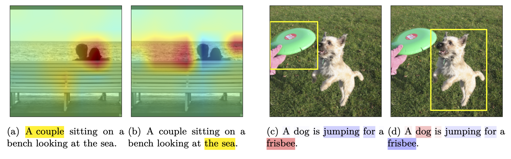

# exCLIP
This repository contains the code for the **TMLR'25** paper [*Explaining Caption-Image Interactions in CLIP Models with Second-Order Attributions*](https://openreview.net/forum?id=HUUL19U7HP).

Try our `demo.ipynb` or install our package with `pip install exclip` to look into how CLIP matches parts of captions and regions in images. We provide Explainer wrappers for the [OpenAI](https://github.com/openai/CLIP) and [OpenClip](https://github.com/mlfoundations/open_clip) models. See below for a minimal example and installation instructions to get started.

If you come across issues or have any other questions, feel free to reach out!

## Contribution

Our method provides *second-order* explanations enabling us to analyze *interactions* between images and captions. This is different from common *first-order* methods that can only explain the importance of *individual* features, not interaction between them.

We can make arbitrary selections over spans in captions and see which image regions correspond to them or vice versa.
This is demonstrated in the follwing plot.



In (a) and (b), we select spans in captions (yellow) and see what they correspond to in the image above. In (c) and (d), we select bounding-boxes in the image (yellow) and see what they correspond to in the caption below. Heatmaps in both images and captions are red for positive and blue for negative values.

For all details, check out the paper!

## Installation

To use our `exclip` package, simply install it with:
```bash
$ pip install exclip
```
You also need to install OpenAI's [clip](https://github.com/openai/CLIP) package with the following command (since it is not available on PyPI):
```bash
$ pip install git+https://github.com/openai/CLIP.git
```

Alternatively, you can directly install this repository:
```bash
$ pip install git+https://github.com/lucasmllr/exCLIP
```
or clone it and run `$ pip install .` inside the cloned directory.
The latter two versions already include the clip installation, too.

## Getting started
The following minimal example initializes a clip model, wraps it into our Explainer and computes interaction explanations for a given image-caption pair.
```python
import clip
from PIL import Image
from exclip import OpenAIExplainer, OpenAITokenizer

device = 'cuda:1'
model, prep = clip.load('ViT-B/16', device=device)
tokenizer = OpenAITokenizer()
explainer = OpenAIExplainer(model, device=device)

image = Image.open("examples/dogs.jpg")
caption = 'A white husky and a black dog running in a snow covered forest.'
cpt_inpt = tokenizer.tokenize(caption).to(device)
img_inpt = prep(image).unsqueeze(0).to(device)  # adds a dummy batch dimension

# computing explanations for all token-patch interactions between the image and caption
interactions = explainer.explain(cpt_inpt, img_inpt)
```

This example is also inclued in `minimal_example_openai.py` and `minimap_example_open_clip.py` contains an equivalent for an OpenClip model. 

The `demo.ipynb` notebook also shows how to visualize the resulting explanations for different token ranges in the caption.

## Issues
We want to make this code as accessible and easily usable as possible. If anything does not work as inteded or if you have any other questions, feel free to reach out or report an issue.

## Citation
If you use our method in academic work, please cite our paper.

```bibtex
@article{
moeller2025explaining,
title={Explaining Caption-Image Interactions in {CLIP} Models with Second-Order Attributions},
author={Lucas Moeller and Pascal Tilli and Thang Vu and Sebastian Pad{\'o}},
journal={Transactions on Machine Learning Research},
issn={2835-8856},
year={2025},
url={https://openreview.net/forum?id=HUUL19U7HP}
}
```